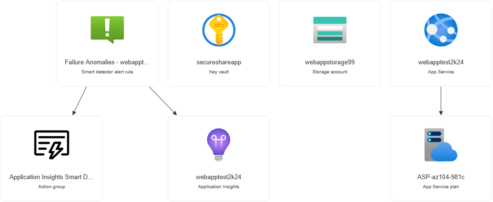
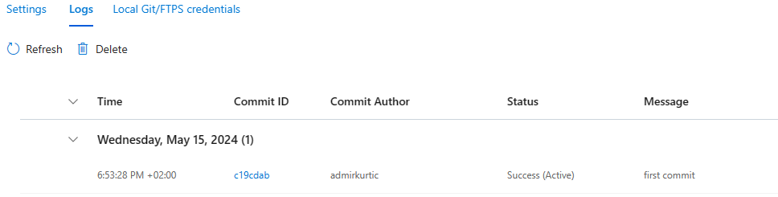
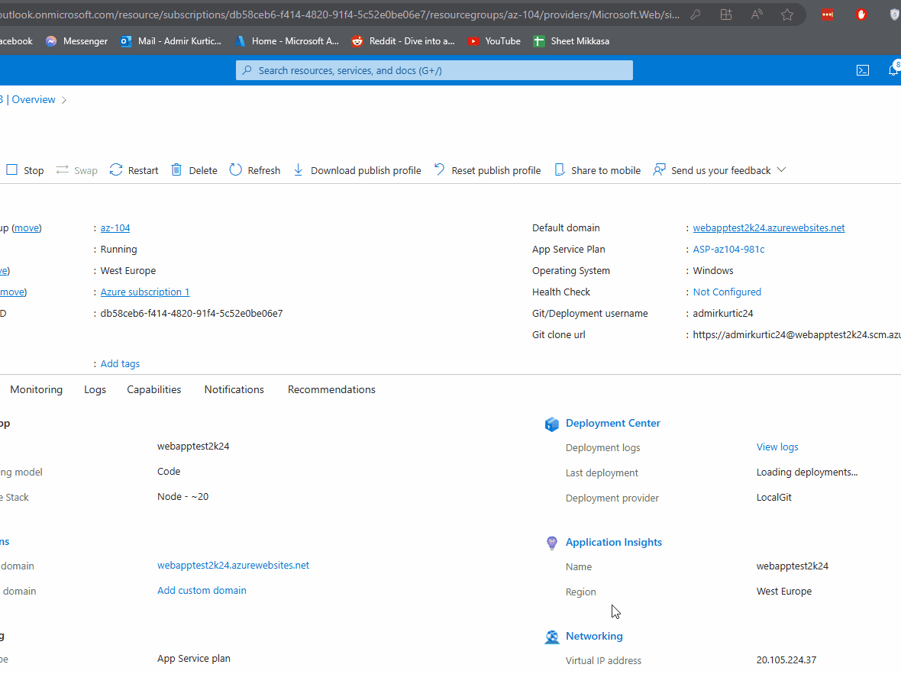
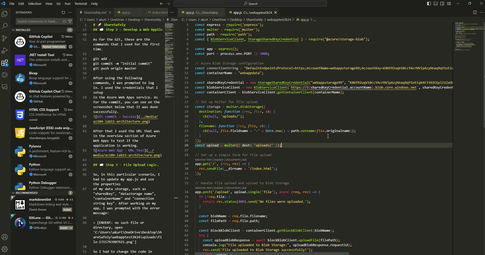
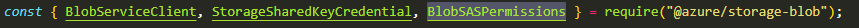
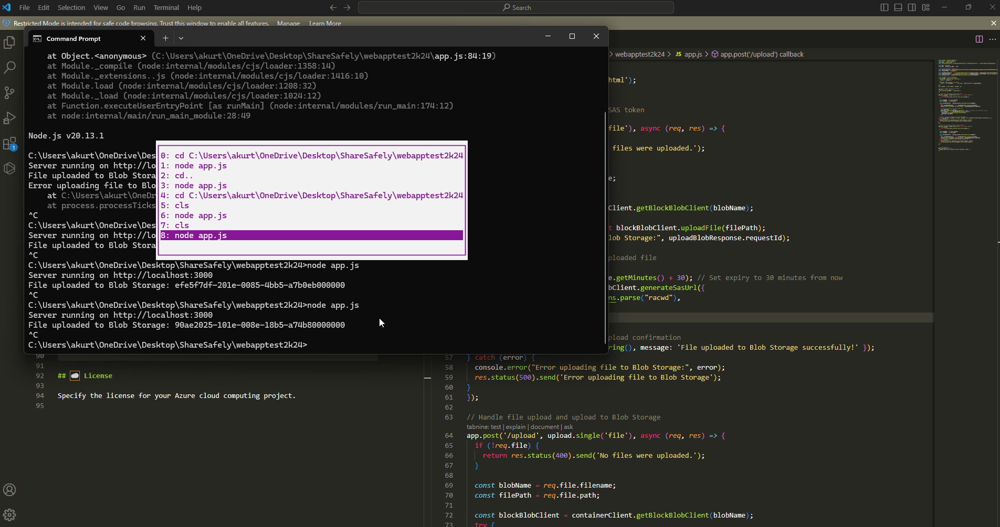
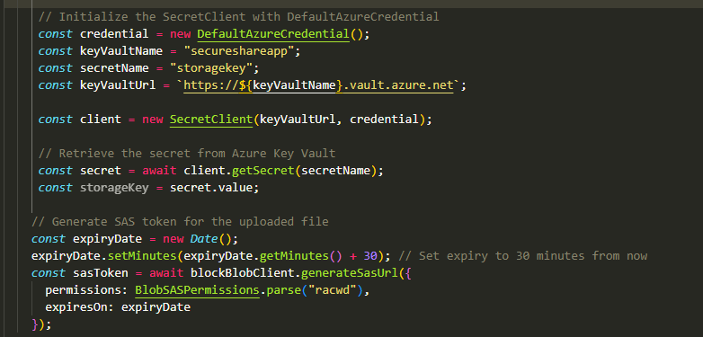

# 🚀 ShareSafely

Create a web application where users can securely upload files to Azure Blob Storage. Once uploaded, the application generates a unique, time-limited link for the user to share. This ensures that only authorized users with the link can access the uploaded file for a specified duration.

## 📋 Table of Contents

- [Introduction](#introduction)
- [Resources Used](#features)
- [Summary](#summary)

## 🌟 Introduction

This project is intended to be used for a securly uploading files to Azure Blob Storage.

## ✨ Features

These are the resources I have used. Some of them I interacted for the first time (nodeJS, Git)

+ Azure Web Apps
+ Azure Data Storage
+ JavaScript
+ NodeJS
+ Git  

## ☁️ Step 1 - Creating a Storage Account

So in this task, I have deployed the Storage Account using Azure Portal.
As for the some basic properties i setup the following:

+ Access Tier: Hot
+ Replication: Locally-redundant storage (this is just the personal project so I don't need a better replication)
+ Enycription Keys: Microsoft Managed Keys

After deploying the Storage Account, I created a container to store the uploaded files.

## ☁️ Step 2 - Develop a Web Application that allows users to upload files. 

So in this part, I was tasked to develop a Web application using node.js.
Since this is my first time using the node.js, I decided to go with documentation and chatGPT to develop the application.
I also added as imple HTML file that is conneced with node.js application.

I run the following command "node app.js" to test if this is working.
My application is working and I tested if its possible to upload the files.

+ App JS (https://github.com/akurtic1/ShareSafely/blob/77f1a38ec3cc16b3403cd9171859eda552863176/media/app.js)
+ Html (https://github.com/akurtic1/ShareSafely/blob/44fb1c28b1316ac9397a8585ae5d764f22048f5e/media/index.html)

After working on the previous tasks, I had to deploy the application using Azure Web Apps.
In the configuration of the Azure Web Apps, I chose "Local Git" as my deployment method.

As for the Git, these are the commands that I used for the first time.

git add .
git commit -m "Initial commit"
git push origin master

After using the following commands, I was prompted to log in. I used the credentials that I setup
in the Azure Web Apps service. As for the commit, you can see on the screenshot below that it was done successfully.

After that I used the URL that was in the overview section of Azure Web Apps to test if the application is working.

## ☁️ Step 3 - File Upload Logic. 

So, in this particular scenario, I had to update my app.js and use the properties
of my data storage, such as "sharedkey", "datastorage name", "containerName" and "connection string key". After working on my app, I was prompted with the error message:

+ [ENOENT: no such file or directory, open 'C:\Users\akurt\OneDrive\Desktop\ShareSafely\webapptest2k24\uploads\file-1715793907921.png']

So I had to change the code in line 26 to "const upload = multer({ dest: 'uploads/' });".
You can see the process using the application on the gif below:

## ☁️ Step 4 - Unique Link Generation. 

In this task, I had to import modules for generating SAS tokens.
('generateBlobSASQueryParameters, BlobSASPermissions, SASProtocol').
 const permissions = BlobSASPermissions.parse("racwd");

 With this line "racwd" we are adding desired permissions for read, create, write and delete.
 After I tried to to run the app.js I recieved the error that I cannot upload the file.

So, I had to import the permission "BlobSASPermissions"

After fixing the errors in the code, now the application is generating
the SAS keys. You can see on the gif below:

## ☁️ Step 5 - Secure Credentials. 

So, in this task I have deployed Azure Key Vault to store any sensitive credentails (like Blob Storage access keys).

The first error that I received was that I was not authorized to create the
secrets so I had to use RBAC to give my self a role "Key Vault Secrets Officer".

You can see the code below for the Azure Key Vault key:

## 📖 Summary

So, in this project, I have deployed Azure Data Storage and connected it with the
node.js application to upload the files. The biggest issiue in this project is that I was
using node.js for the first time, but I still managed to adjust the code as needed to work properly.
Overall project tought me how to use Azure services not just on the Portal or CLI but in the other
languages as well.
